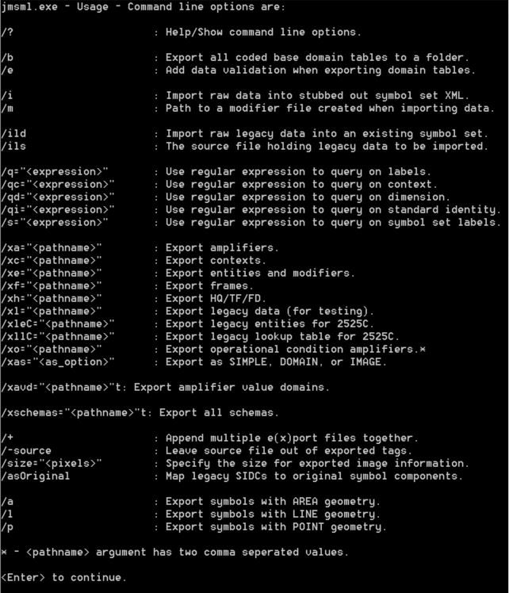

# joint-military-symbology-xml #

## Samples ##

This samples folder contains sample output from the tools included in this repo.  This document explains how these files were generated.

Usage for the jmsml console application is:

### All_Entities.csv and All_Modifiers.csv ###
Generated using the following jmsml command line arguments, to export all of the current contents of the JMSML library:

	jmsml.exe /x="All"

### Air_Entities.csv and Air_Modifiers.csv ###
Generated using the following jmsml command line arguments, to extract just the contents of the Air symbol set from the JMSML library:

	jmsml.exe /x="Air" /s="^Air$"

### LightAir_Entities.csv and LightAir_Modifiers.csv ###
Generated using the following jmsml command line arguments, to extract just the contents of the Air symbol set, where the label and/or category information contains the word "Light".

	jmsml.exe /x="Air" /s="^Air$" /q="Light"

### Coded Domain Tables ###
The coded domain tables are comma separated files that have been exported from the JMSML library, for use by developers who need a straightforward dump of its contents.  It contains the label attribute and SIDC code for each element in the standard, exported to multiple files.  The /b switch value should be the location (folder) in which you want the files placed.

The optional /e switch causes the coded domain table export to add additional data validation information to the output.

	jmsml.exe /b=".'
	jmsml.exe /b="." /e

### Coded Domain Entity/Modifier Tables ###
Coded domain tables for entities and modifiers can be generated with or without the same optional filters/regular expressions documented above (with the /s, /q, /a, /l, and /p switches) by specifying the /xd switch.

	jmsml.exe /xd="All_Coded_Domain"
	jmsml.exe /xd="Air_Coded_Domain" /s="^Air$"

### Image File, Name, Category, Tags Tables ###
The information exported in these files includes that which can be used to generate ArcGIS Style files.  The information includes the path and name of each graphic/image file for a symbol, its name, the category of icon it belongs to, and a semicolon delimited list of tag values that users can use to find a given symbol.

The /s, /q, /a, /l, and /p switches documented above are also respected.  /+ can be used to tell the exporter to append the modifier output to the end of the entity output.

	jmsml.exe /xi="Military-Air-Source-Icons" /s="Air"
	jmsml.exe /xi="Military-Air-Source-Icons" /s="Air" /+

